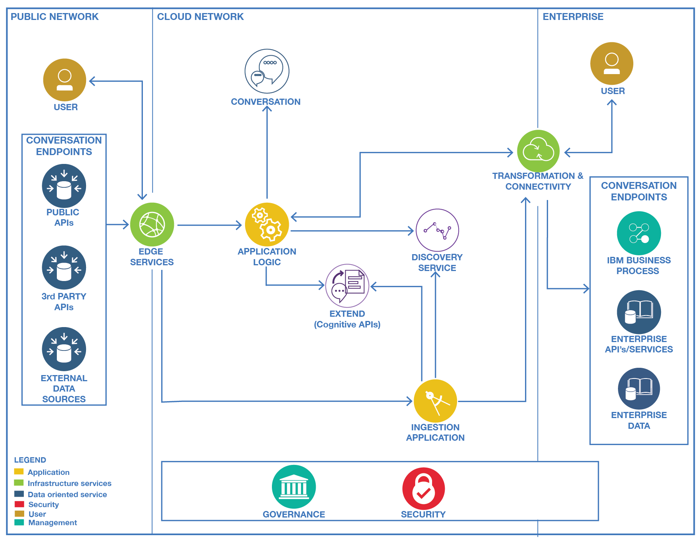

# Cognitive Reference Architecture

## Architecture
This project provides a reference implementation for building cognitive application on the cloud using micro service architecture, Watson Cloud development APIs, and Cloud Service Management and Operations. At the high level the set of code repositories defined in this compute model, also named cyan compute, will support the following diagram:

[Architecture Center - Cognitive Architecture](https://www.ibm.com/devops/method/content/architecture/cognitiveArchitecture#0_0)
## Project Repositories
This project leverages other projects by applying clear separation of concerns design and micro service approach.
* [Cognitive Conversation Broker](https://github.com/ibm-cloud-architecture/refarch-cognitive-conversation-broker)
* [Cognitive Discovery Broker](https://github.com/ibm-cloud-architecture/refarch-cognitive-discovery-broker)
* [Cognitive Extends](https://github.com/ibm-cloud-architecture/refarch-cognitive-extends)
* [Context driven dialog with ODM](https://github.com/ibm-cloud-architecture/context-driven-dialog)
* [Supplier Business Process](https://github.com/ibm-cloud-architecture/refarch-cognitive-supplier-process)

## Run the reference application locally and on IBM Bluemix
To run the sample application you will need to configure your Bluemix environment by adding web application (nodejs sdk) and some of the Watson services... See each specific project for instructions.

### Prerequisites
* You need your own [github.com](http://github.com) account
* You need a git client code. For example for [Windows](https://git-scm.com/download/win) and for [Mac](https://git-scm.com/download/mac)
* Install [npm](https://www.npmjs.com/get-npm) and [nodejs](). Normally getting nodejs last stable version will bring npm too.
* You need to have a [Bluemix](http://bluemix.net) account, and know how to use cloud foundry command line interface to push to bluemix, the web application used to demonstrate the solution.
* Install the Bluemix CLI: As IBM Bluemix application, many commands will require the Bluemix CLI toolkit to be installed on your local environment. To install it, follow [these instructions](https://console.ng.bluemix.net/docs/cli/index.html#cli)

### Create a New Space in Bluemix

1. Click on the Bluemix account in the top right corner of the web interface.
2. Click Create a new space.
3. Enter "cognitive-dev" for the space name and complete the wizard.

### Get application source code

Clone the base repository: ``` git clone https://github.com/ibm-cloud-architecture/refarch-cognitive```

Clone the peer repositories: ```./clonePeers.sh```  

### Build and run locally each application.
See instruction and tutorial in each project.

## Contribute
We welcome your contribution. There are multiple ways to contribute: report bugs and improvement suggestion, improve documentation and contribute code.
We really value contributions and to maximize the impact of code contributions we request that any contributions follow these guidelines
* Please ensure you follow the coding standard and code formatting used throughout the existing code base
* All new features must be accompanied by associated tests
* Make sure all tests pass locally before submitting a pull request
* New pull requests should be created against the integration branch of the repository. This ensures new code is included in full stack integration tests before being merged into the master branch.
* One feature / bug fix / documentation update per pull request
* Include tests with every feature enhancement, improve tests with every bug fix
* One commit per pull request (squash your commits)
* Always pull the latest changes from upstream and rebase before creating pull request.

If you want to contribute, start by using git fork on this repository and then clone your own repository to your local workstation for development purpose. Add the up-stream repository to keep synchronized with the master.
