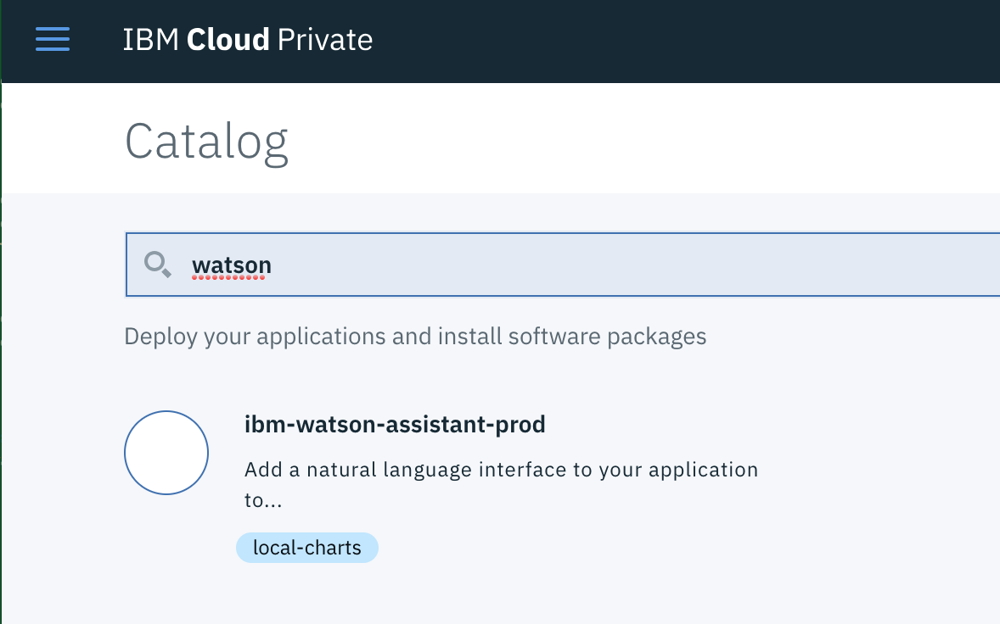
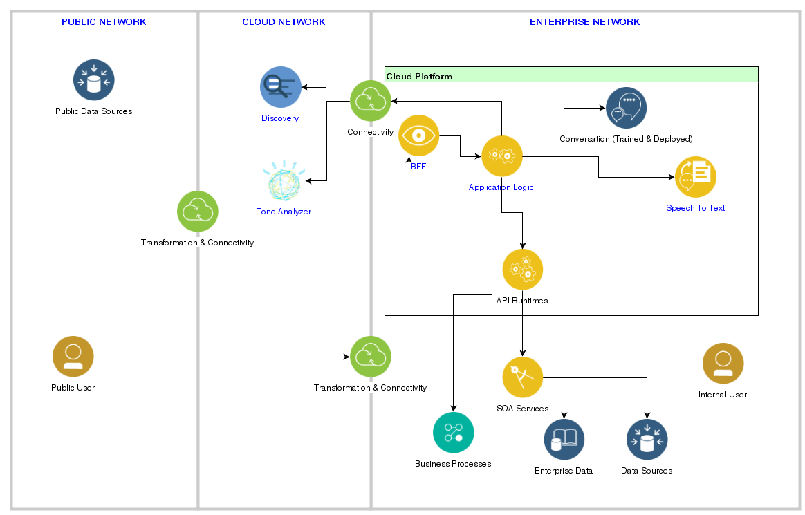
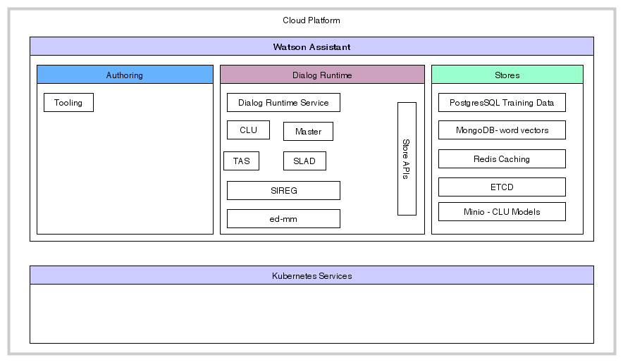
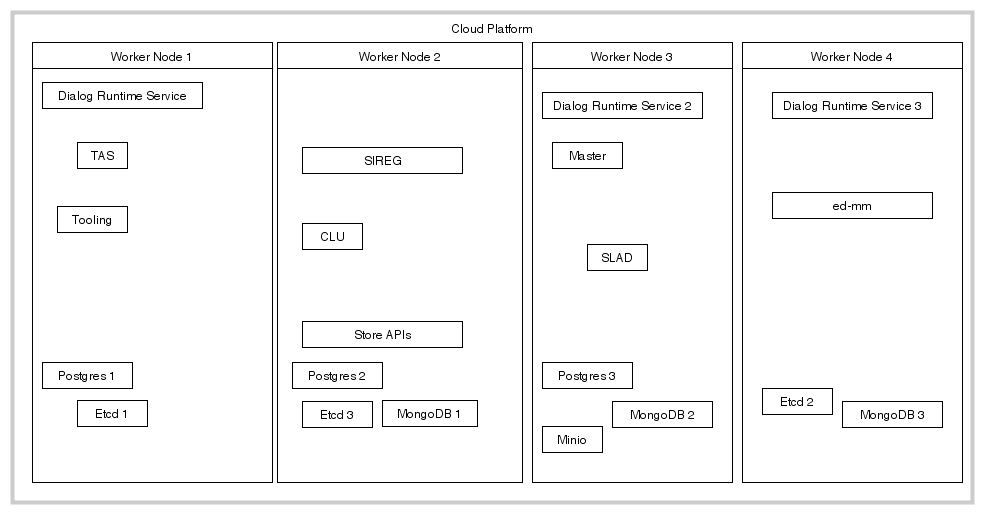

# Deploy Watson Assistant on ICP

Update 11/05/2018

The product installation instructions are [here](https://console.bluemix.net/docs/services/assistant-icp/install.html#install).

*Some items to be sure to know*
* Deploy only on x86 architecture
* At least 4 worker nodes

What we have to adapt some of the steps to deploy to our vSphere environment:

* Download the Watson Assistant product from Passport Advantage (Linux 64bit code CNX12EN) on a NFS server.
* We already have an ICP 2.1.0.3
* For production environment the ICP needs to have 3 master nodes, 3 proxies and more than 4 worker nodes. Watson Assistant is deployed only on worker nodes.
* We install only English language  
* Get a NFS server or Ceph cluster for persistence. The size of the allocated disk on the NFS server was 4TB.
* As we have limited access to the DNS server
* create 4 folders in the NFS server `/storage/assistantpvs` named pv01, pv02, pv03, pv04
* on each worker node 01 to 04 create the mount point /tmp/assitantpvs/pv01 to pv04 accordingly.
* mount `sudo mount 172.16.253.184:/storage/assistantpvs/pv01 /tmp/assistantpvs/pv01 on worker node 01. Do the same for other worker node.
* do the same for a folder minio on worker node 4.  `sudo mount 172.16.253.184:/storage/assistantpvs/minio /tmp/assistantpvs/minio`
* Use the manifest `assistant-pvs.yaml` to add the PV in the cluster.
* `kubectl get pv ` should return
```
etcd-pv01    10Gi       RWO            Recycle  
etcd-pv02    10Gi       RWO            Recycle
etcd-pv03    10Gi       RWO            Recycle                                       
minio-pv01   20Gi       RWO            Recycle   
mongo-pv01   80Gi       RWO            Recycle  
mongo-pv02   80Gi       RWO            Recycle    
mongo-pv03   80Gi       RWO            Recycle    
postgress-pv01  10Gi       RWO            Recycle  
postgress-pv02  10Gi       RWO            Recycle    
postgress-pv03  10Gi       RWO            Recycle  
```

* Upload the product images to the internal docker repository: `bx pr load-ppa-archive --archive IWAICP_V1.0.0.1.tar.gz --clustername green-with-envy-cluster.icp --namespace conversation`

 The traces should list at least the following successful messages:
 ```
 Expanding archive
 OK
 Loaded helm chart
 OK
 Synch charts
 Synch started
 OK
 Archive finished processing
 ```
 If for any reason you got this message: `unauthorized: authentication required`, be to be logged and helm is working and connected to the Tiller server. You need to login and be sure helm works. Something like the following commands help:
 ```
bx pr login -a https://172.16.50.154:8443 --skip-ssl-validation docker login http://172.16.50.154:8500
  helm init --client-only
 ```

 * Once done be sure to synchronize the Helm repositories, as of now it is not possible to install Watson Assistant with the ICP Console, but still you need to updload the image. So first ensure the local-charts repo is defined. Something like:
  `local-charts	https://green-with-envy-cluster.icp:8443/helm-repo/charts`
  * Get To the ICP catalog to search for Watson:   
    

  * At this stage the installation instruction is proposing to use values.yaml but does not give how to access it. So from a computer where you can access the cluster using helm and kubectl, first download the tar file:
  `curl -k -O https://green-with-envy-cluster.icp:8443/helm-repo/requiredAssets/ibm-watson-assistant-prod-1.0.0.tgz`
  * un tar  
  ```
  tar -xzvf ibm-watson-assistant-prod-1.0.0.tgz ibm-watson-assistant-prod/values.yaml -C ./ --strip-components=1
  ```
  * update the extracted values.yml with the name of the cluster and removing the Czech language. You may change default passwords if you want.
  ```
  global:
  schConfigTemplate: assistant.sch.chart.config.values
  deploymentType: Development
  icpUrl: 'green-with-envy-cluster.icp'
  languages:
    english: true
    czech: false
  ```
  * You can tune the following parameters in values.yaml

| parameter | value |  
| --- | --- |
| language | select English, unselect Czech|
| Create Cloud Object Store COS | must be selected |
| Create Redis | must be selected |
| Redis Password | |
| Create Postgres | must be selected |
| Postgres Admin Password | |  
| Create Database | must be selected |
| Create Schema | must be selected |
| Postgres User Password | |
| Create Etcd cluster | must be selected |
| Create MongoDB | must be selected |
| MongoDB Admin user name | admin |
| MongoDB Admin password |  |

 * Deploy using helm:
 ```
 helm install --tls --namespace conversation --name assistant -f values.yaml ibm-watson-assistant-prod-1.0.0.tgz
 ```
 if you have some issues in connection, tiller versioning, ... see the ICP troubleshooting note


### New Deployment Diagram In Hybrid Cloud
The following diagram is an adaptation of the diagram in the Cognitive reference architecture you can find in the IBM [Garage architecture center](https://www.ibm.com/cloud/garage/architectures/cognitiveArchitecture/reference-architecture)



In this diagram, we can see that the deployment of the `conversation` and `speech to text` services are now done on cloud platform running in the enterprise network or on-premise environment.

Using product mapping:
* the Cloud Platform is IBM Cloud Private
* the Conversation is Watson Assistant for ICP
* Speech to text is Watson Speech to Text for ICP
* API Runtimes is IBM API Connect for ICP
* The BFF is a microservice responsible to support API for the webapp or mobile app. It will be a customer component. Example of such BFF can be found in this project
* The Application Logic is a microservice exposing a set of APIs to implement service orchestration. The BFF of the previous project is also doing the application logic.

#### Physical Deployment
The Watson Assistant Helm chart installs the following microservices:

* **Dialog**: Dialog runtime, or user-chat capability.
* **Store**: API endpoints.
* **CLU** (Conversational Language Understanding): Interface for store to communicate with the back-end to initiate ML training.
* **Master**: Controls the lifecycle of underlying intent and entity models.
* **TAS**: Manages services model inferencing.
* **SLAD**: Manages service training capabilities.
* **SIREG** - Manages tokenization and system entity capabilities.
* **ed-mm**: Manages system entity capabilities.
* **Tooling**: Provides the developer user interface.

and the following stores:

* **PostgreSQL**: Stores training data.
* **MongoDB**: Stores word vectors.
* **Redis**: Caches data.
* **etcd**: Manages service registration and discovery.
* **Minio**: Stores CLU models.

The following diagram illustrates the Logical model for those components:   



Finally when deploying Watson Assistant within a kubernetes platform like ICP we will have potentially the following pod allocations:


