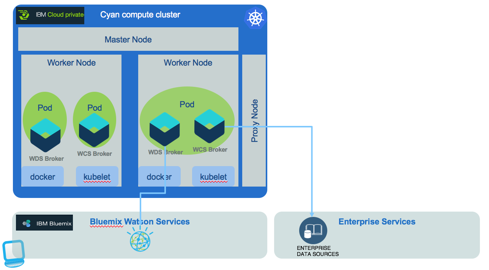

# Cognitive computing deployed in Kubernetes cluster

This article presents how the **Cyan computing** components are deployed into Kubernetes Cluster platform like IBM Cloud Private or Bluemix Container service. Each broker and web app components have a dockerfile to containerize them, and a helm chart definition to deploy to Tiller server.

[Back to cognitive root project](../README.md)

# Container based deployment
We propose two deployment environments:
* [IBM Cloud Private](#ibm-cloud-private-deployment)
* [IBM Bluemix Container Service]()

The following diagram illustrates how the *cyan computing* components can run within pods but accessing public Watson services and enterprise data sources:  
  

## Pre-requisites
You need a set of tools before using Kubernetes cluster on Bluemix: run `./install_cli.sh` script (for windows use the `install_cli.bat`). This script should install the bluemix command line interface, bluemix container service plugin, Bluemix Container Registry Service, Kubernetes CLI (kubectl), Helm CLI (helm).

## IBM Cloud Private deployment
Typical ICP environment will include multiple installations, one per staging environment. For development purpose we are detailing in [this note](doc/icp/README.md) how to install and set up ICP Community Edition.

Then each project describes its own Helm configuration and deployment command:
* [Watson conversation broker](https://github.com/ibm-cloud-architecture/refarch-cognitive-conversation-broker/blog/master/docs/doc/icp/README.md)

## Bluemix Container Service deployment

### Cluster Configuration

There are multiple models for Kubernetes cluster, for demonstration purpose the *lite* model is used, but for production the paid model is mandatory as it brings a lot of useful features for high availability, load balancing...

Clusters are specific to an account and an organization, but are independent from a Bluemix space.
Using Bluemix service and CLI we can create cluster. The following steps were done to create environment:
* bx cs cluster-create --name cyancomputecluster
* bx cs workers cyancomputecluster

Nodes or Worker nodes are virtual or physical servers, managed by the Kubernetes master, and hosting containerized applications. An app in production runs replicas of the app across multiple worker nodes to provide higher availability. A node has a public IP address.
Every containerized app is deployed, run, and managed by a pod.

### Further Readings
* [ICP common notes and knowledge sharing](https://github.com/ibm-cloud-architecture/refarch-integration/blob/master/docs/icp/README.md)
* [CLI command summary](https://github.com/ibm-cloud-architecture/refarch-integration/blob/master/docs/icp/icp-cli.md)

* [Kubernetes Official site](https://kubernetes.io)
* [Very good tutorial from kubernetes web site](https://kubernetes.io/docs/tutorials/kubernetes-basics/scale-intro/)
* [Garage method tutorial on Kubernetes](https://cloudcontent.mybluemix.net/devops/method/tutorials/kubernetes)

#### IBM Cloud Private Compendium
* [IBM technical community](https://www.ibm.com/developerworks/community/wikis/home?lang=en#!/wiki/W1559b1be149d_43b0_881e_9783f38faaff)
* [ICP blog](https://www.ibm.com/developerworks/community/blogs/fe25b4ef-ea6a-4d86-a629-6f87ccf4649e?lang=en)
* [Common configuration for developer](https://github.com/ibm-cloud-architecture/refarch-integration/blob/master/docs/icp/icp-deploy.md#common-installation-tasks)
